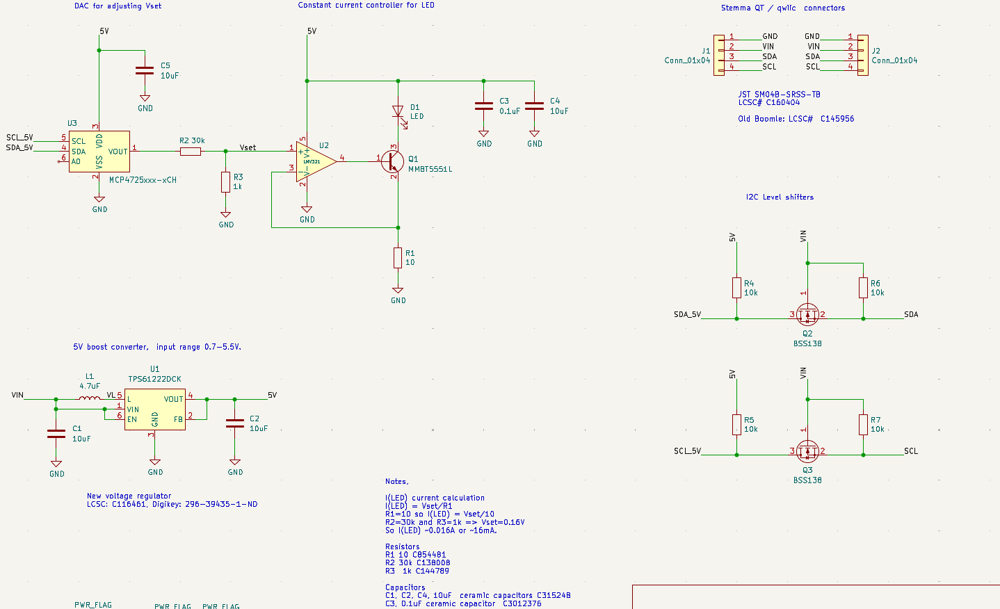
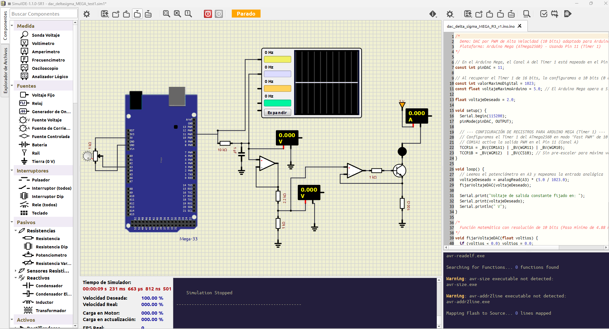

# Pruebas del circuito control de corriente


[video control led mega](./imgs/test_control_led_mega_v1.mp4)

## Circuito original
El circuito fue adaptado del diseño original de IORODEO.



## Circuito adaptado
EL circuito original original esta pensado en un microcontrolador de 3.3v por lo que requeria etapas para elevar la tensión de 3.3v a 5v. En ese sentido se optó por probar la tarjeta Arduino Mega que funciona a 5 v. 
Una parte relevante del circuito es setear la tensión de referencia que servirá para controlar la corriente del led (0mA-16mA), para ello se requiere un DAC para cambiar la tensión de salida que servirá para cambiar la intensidad del LED. En ese sentido el arduino Mega no cuenta con un DAC nativo por lo que se uso la configuración de DAC delta-sigma que emula una DAC usando PWM, para ello adicionalmente se debe usar un filtro pasa bajos a la salida del PWM. El arduino MEga usó su Timer 1 con el pin 11 para generar el DAC delta-sigma.



EL código del Mega fue este:
```c++
/*
  Demo: DAC por PWM de Alta Velocidad (10 bits) adaptado para Arduino Mega
  Plataforma: Arduino Mega (ATmega2560) - Usando Pin 11 (Timer 1)
*/

// En el Arduino Mega, el Canal A del Timer 1 está mapeado en el Pin 11
const int pinDAC = 11; 

// Al recuperar el Timer 1 de 16 bits, lo configuramos a 10 bits (0 a 1023)
const int valorMaximoDigital = 1023; 
const float voltajeMaximoArduino = 5.0; // El Arduino Mega opera a 5.0V

float voltajeDeseado = 2.0; 

void setup() {
  Serial.begin(115200);
  pinMode(pinDAC, OUTPUT);

  // --- CONFIGURACIÓN DE REGISTROS PARA ARDUINO MEGA (Timer 1) ---
  // Configuramos el Timer 1 del ATmega2560 en modo "Fast PWM" de 10 bits (Frecuencia ~15.6 kHz)
  // COM1A1 activa la salida PWM en el Pin 11 (Canal A)
  TCCR1A = _BV(COM1A1) | _BV(WGM11) | _BV(WGM10);
  TCCR1B = _BV(WGM12)  | _BV(CS10); // Sin pre-escaler para máxima velocidad de conmutación
}

void loop() {
  // Leemos el potenciómetro en A3 y mapeamos la entrada analógica
  voltajeDeseado = analogRead(A3) * (5.0 / 1023.0);
  fijarVoltajeDAC(voltajeDeseado);
  
  Serial.print("Voltaje de salida constante fijado en: ");
  Serial.print(voltajeDeseado);
  Serial.println(" V");
}

/*
  Función matemática con resolución de 10 bits (Paso mínimo de 4.88 mV)
*/
void fijarVoltajeDAC(float voltios) {
  if (voltios < 0.0) voltios = 0.0;
  if (voltios > voltajeMaximoArduino) voltios = voltajeMaximoArduino;

  // Regla de tres directa adaptada a 5V y resolución de 1023:
  int valorPWM = (voltios * valorMaximoDigital) / voltajeMaximoArduino;

  // Actualizamos directamente el registro de comparación del Timer 1 (Canal A -> Pin 11)
  OCR1A = valorPWM; 
}
```
