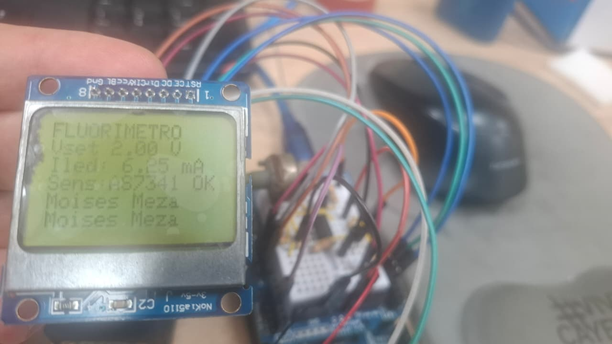
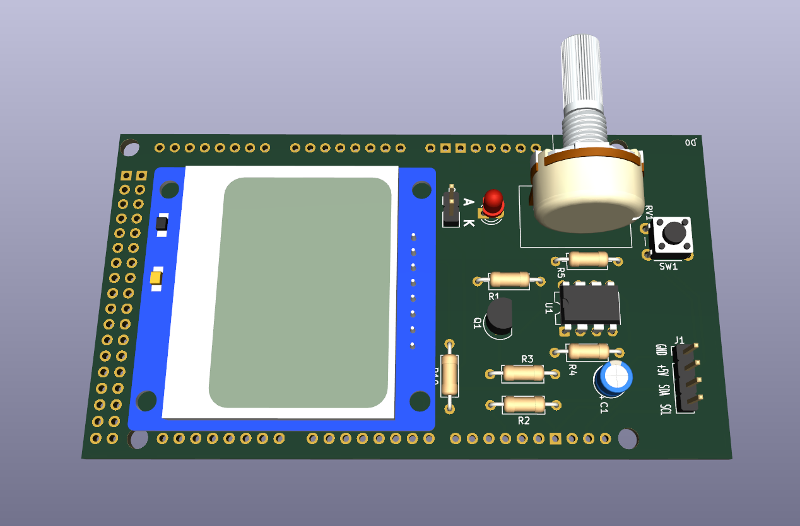

# Pruebas de circuitos y códigos previo a la implementación del prototipo del fluorimetro

Las pruebas son:

- 1_CORRIENTE_DELTA_SIGMA: Que es el circuito para implementar el control de corriente lineal del led por medio de una DAC delta-sigma que usa el pin 11 del arduino mega, pin que usa  PWM para simular una DAC. Se le agrega un filtro RC para pasar de PWM a valor analógico.
- 2_DAC_LED_UNO_R4: Busca usar el DAC nativo del arduino uno R4 y aprovechar su puerto QWIIC nativo para usar el sensor de color.
- 3_TEST_KICAD: Se creo una shield para arduino mega que incorpora una pantalla LCD NOKIA.

## Test LCD Nokia

## Test PCB


## Código de LCD Nokia
Las Librerias deben ser instaladas usando el entorno de Arduino IDE.
- Adafruit_GFX
- Adafruit_PCD8544

Código:

```c++
#include <SPI.h>
#include <Adafruit_GFX.h>
#include <Adafruit_PCD8544.h>

// Definición de pines para Arduino Mega (Configuración por Software SPI)
// Pin 13 - CLK (conectado mediante resistencia de 10k a la pantalla)
// Pin 11 - DIN (conectado mediante resistencia de 10k a la pantalla)
const int pin_DC  = 5;
const int pin_CE  = 4;
const int pin_RST = 3;

// Inicializamos la pantalla con el constructor de Software SPI
Adafruit_PCD8544 display = Adafruit_PCD8544(52, 51, pin_DC, pin_CE, pin_RST);

void setup() {
  Serial.begin(115200);
  
  // Inicializar la pantalla con el contraste típico (ajustar entre 50 y 60 si no se ve)
  display.begin();
  display.setContrast(55); 
  delay(1000);
  display.clearDisplay();   // Borra el buffer interno
  display.setRotation(2);
  display.display();        // Muestra la pantalla en blanco inicial
  delay(1000);
}

void loop() {
  display.clearDisplay();
  
  // Configuración de texto
  display.setTextSize(1);      // Tamaño de fuente pequeño (ideal para esta pantalla)
  display.setTextColor(BLACK); // Texto negro sobre fondo claro
  
  // Simulación de interfaz para tu Fluorímetro
  display.setCursor(0,0);
  display.println("FLUORIMETRO");
  
  display.setCursor(0,8);
  display.print("Vset 2.00 V"); // Simulación del voltaje seteado [cite: 422]
  
  display.setCursor(0,16);
  display.print("Iled: 6.25 mA"); // Simulación de la corriente calculada [cite: 376]
  
  display.setCursor(0,24);
  display.print("Sens:AS7341 OK"); // Estado de tu nuevo sensor [cite: 547]
  
  display.setCursor(0,32);
  display.print("Moises Meza");

  display.setCursor(0,40);
  display.print("Moises Meza");
  // Enviamos los datos del buffer directamente a la pantalla física
  display.display();
  
  delay(2000);
}
```