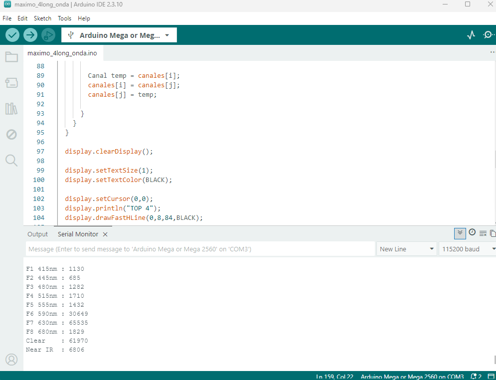
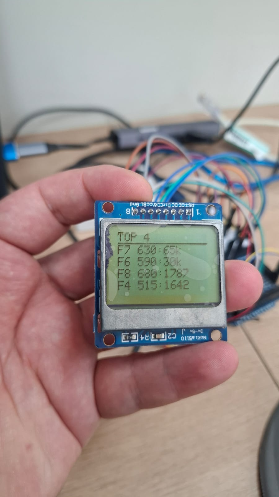

# RECEPTOR

A nivel del receptor estamos trabajando con el AS7341
El AS7341 es un sensor espectral multicanal de alta precisión desarrollado por ams OSRAM, ideal para aplicaciones de análisis de color y espectroscopia como tu fluorímetro:
* Canales de Medición: Cuenta con un total de 10 canales:
    * 8 canales visibles (F1 a F8) con filtros ópticos integrados de fábrica, que cubren desde el violeta hasta el rojo lejano (de $415\text{ nm}$ a $680\text{ nm}$).
    * 1 canal NIR (Infrarrojo Cercano) sintonizado a $910\text{ nm}$.
    * 1 canal Clear que mide la luz blanca total sin filtrar.

* Comunicación: Se conecta mediante el protocolo I2C, lo que facilita su integración directa con microcontroladores como el Arduino Mega utilizando solo dos cables de datos (SDA y SCL).
* Conversión Analógica-Digital (ADC): Incorpora conversores ADC independientes para procesar las lecturas de los fotodiodos de manera simultánea, entregando datos digitales de alta resolución directamente al microcontrolador.
* Ganancia y Tiempo de Integración Ajustables: Permite configurar parámetros de ganancia interna (hasta 512x o más) y tiempos de integración mediante software, lo cual es fundamental en fluorometría para detectar señales de luz extremadamente tenues sin saturar el sensor.


# Pruebas
La libreria para usar el AS7341 es ```Adafruit AS7341``` en el ide de arduino.

## 1_TEST_AS7341

### firmware2
Actualmente el firmware2 es el código funcional. Permite controlar el brillo del LED y la muestra de los maximos valores de los canales del sensor.


### long_onda_oled
Se desarrollo un código para mostrar los canales y su intensidad.



A nivel de implementación se adaptó el código para poder visualizarse en el OLED NOKIA. Se muestra solamente los 4 máximos valores, ya que el NOKIA solo tiene limitado visivilidad.



## Código

```c
#include <Wire.h>
#include <SPI.h>
#include <Adafruit_GFX.h>
#include <Adafruit_PCD8544.h>
#include <Adafruit_AS7341.h>

//================== Pantalla Nokia 5110 ==================

// Pines de la pantalla
const int pin_DC  = 5;
const int pin_CE  = 4;
const int pin_RST = 3;

// Software SPI: CLK, DIN, DC, CE, RST
Adafruit_PCD8544 display = Adafruit_PCD8544(52, 51, pin_DC, pin_CE, pin_RST);

//================== Sensor AS7341 ==================

Adafruit_AS7341 as7341;

// Estructura para almacenar nombre y valor de cada canal
struct Canal {
  const char* nombre;
  uint16_t valor;
};

void setup() {

  Serial.begin(115200);

  // Inicializar pantalla
  display.begin();
  display.setContrast(55);
  display.setRotation(2);
  display.clearDisplay();
  display.display();

  // Inicializar sensor
  if (!as7341.begin()) {

    display.clearDisplay();
    display.setCursor(0,0);
    display.println("ERROR");
    display.println("AS7341");
    display.println("No detectado");
    display.display();

    while (1);
  }

  // Configuración para alta sensibilidad
  as7341.setATIME(100);
  as7341.setASTEP(999);
  as7341.setGain(AS7341_GAIN_256X);
}

void loop() {

  if (!as7341.readAllChannels()) {
    Serial.println("Error leyendo AS7341");
    delay(500);
    return;
  }

  actualizarPantalla();

  delay(200);
}

void actualizarPantalla() {

  Canal canales[8] = {
    {"F1 415", as7341.getChannel(AS7341_CHANNEL_415nm_F1)},
    {"F2 445", as7341.getChannel(AS7341_CHANNEL_445nm_F2)},
    {"F3 480", as7341.getChannel(AS7341_CHANNEL_480nm_F3)},
    {"F4 515", as7341.getChannel(AS7341_CHANNEL_515nm_F4)},
    {"F5 555", as7341.getChannel(AS7341_CHANNEL_555nm_F5)},
    {"F6 590", as7341.getChannel(AS7341_CHANNEL_590nm_F6)},
    {"F7 630", as7341.getChannel(AS7341_CHANNEL_630nm_F7)},
    {"F8 680", as7341.getChannel(AS7341_CHANNEL_680nm_F8)}
  };

  // Ordenar de mayor a menor
  for (int i = 0; i < 7; i++) {
    for (int j = i + 1; j < 8; j++) {

      if (canales[j].valor > canales[i].valor) {

        Canal temp = canales[i];
        canales[i] = canales[j];
        canales[j] = temp;

      }
    }
  }

  display.clearDisplay();

  display.setTextSize(1);
  display.setTextColor(BLACK);

  display.setCursor(0,0);
  display.println("TOP 4");
  display.drawFastHLine(0,8,84,BLACK);

  for (int i = 0; i < 4; i++) {

    display.setCursor(0,10 + i*9);

    display.print(canales[i].nombre);
    display.print(":");

    uint16_t v = canales[i].valor;

    // Mostrar valores grandes en miles para que entren en la pantalla
    if (v >= 10000) {
      display.print(v / 1000);
      display.print("k");
    } else {
      display.print(v);
    }
  }

  display.display();

  // También imprimir por Serial
  /*
  Serial.println("----- TOP 4 -----");
  for (int i = 0; i < 4; i++) {
    Serial.print(canales[i].nombre);
    Serial.print(": ");
    Serial.println(canales[i].valor);
  }
  Serial.println();
  */
    Serial.print("F1 415nm : ");
  Serial.println(as7341.getChannel(AS7341_CHANNEL_415nm_F1));
  Serial.print("F2 445nm : ");
  Serial.println(as7341.getChannel(AS7341_CHANNEL_445nm_F2));
  Serial.print("F3 480nm : ");
  Serial.println(as7341.getChannel(AS7341_CHANNEL_480nm_F3));
  Serial.print("F4 515nm : ");
  Serial.println(as7341.getChannel(AS7341_CHANNEL_515nm_F4));
  Serial.print("F5 555nm : ");
  Serial.println(as7341.getChannel(AS7341_CHANNEL_555nm_F5));
  Serial.print("F6 590nm : ");
  Serial.println(as7341.getChannel(AS7341_CHANNEL_590nm_F6));
  Serial.print("F7 630nm : ");
  Serial.println(as7341.getChannel(AS7341_CHANNEL_630nm_F7));
  Serial.print("F8 680nm : ");
  Serial.println(as7341.getChannel(AS7341_CHANNEL_680nm_F8));

  Serial.print("Clear    : ");
  Serial.println(as7341.getChannel(AS7341_CHANNEL_CLEAR));

  Serial.print("Near IR  : ");
  Serial.println(as7341.getChannel(AS7341_CHANNEL_NIR));

  Serial.println("");
}
```
