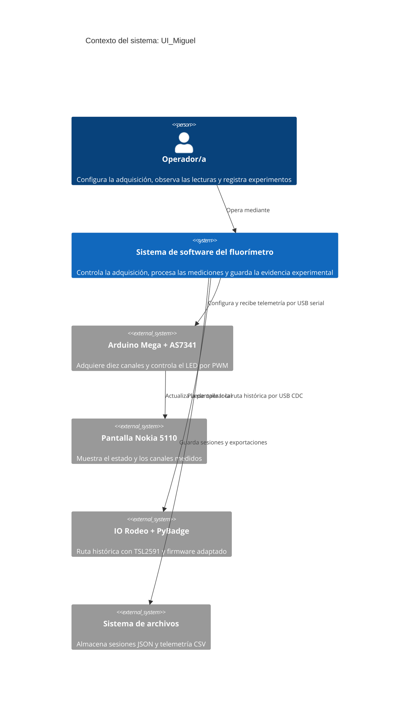
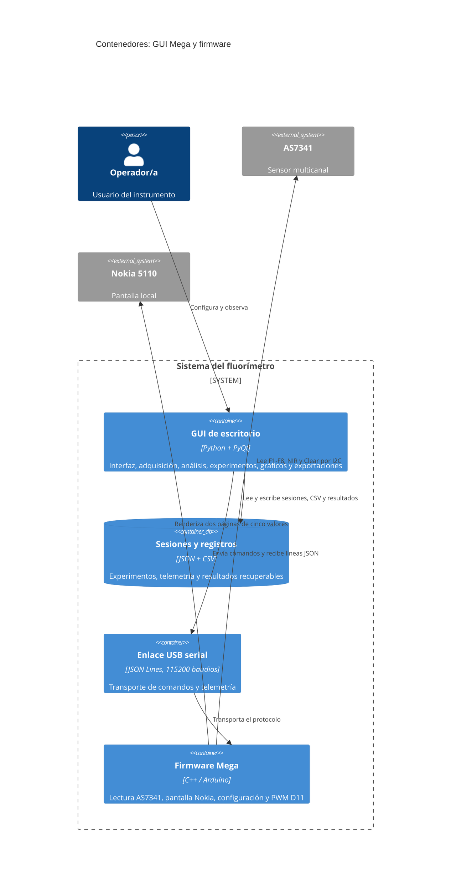
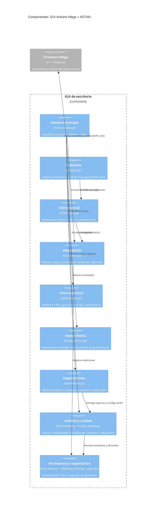

# Arquitectura de software de `UI_Miguel`

Esta sección describe la arquitectura del contenido de [`UI_Miguel/`](UI_Miguel/) con el modelo C4. La ruta principal es la demostración con Arduino Mega 2560 y AS7341; la integración IO Rodeo con PyBadge y TSL2591 se conserva como una ruta histórica compatible.

## Nivel 1: contexto del sistema

El sistema permite operar el fluorímetro, observar las lecturas espectrales y conservar resultados experimentales. La persona operadora interactúa con la GUI desde un computador; el hardware realiza la adquisición y aplica los parámetros recibidos.

## Nivel 2: contenedores

En C4, los contenedores son unidades desplegables o ejecutables. En la ruta Mega, la aplicación Python se ejecuta en el computador y el firmware C++ se carga en el microcontrolador.

La ruta histórica utiliza los contenedores `IO_Rodeo_TSL2591_GUI/v1.0` y `Firmware/IO_Rodeo_PyBadge/v2.0_tsl2591_gui`. La GUI recibe por USB CDC los valores que el PyBadge usa para su pantalla y permite observarlos, graficarlos y exportarlos; no sustituye la adquisición del firmware.

## Nivel 3: componentes de la GUI Mega

Los componentes se corresponden con los módulos de [`Software/Arduino_Mega_AS7341_GUI/v1.0/desktop_gui/`](UI_Miguel/Software/Arduino_Mega_AS7341_GUI/v1.0/desktop_gui/).

## Nivel 4: código y contratos principales

El nivel de código se resume en los contratos que conectan los componentes. No se detallan todas las funciones internas para evitar convertir el README en una copia del código fuente.

| Elemento | Responsabilidad o contrato |
| --- | --- |
| `mega_as7341_multichannel.ino` + `firmware.cpp` | Inicializa AS7341 y Nokia, lee diez canales raw, aplica ganancia, integración y PWM de D11, y emite estado/telemetría JSON Lines. |
| `protocol.py` | Mantiene el formato de comandos como `set_gain`, `set_integration`, `set_pwm` y las respuestas del firmware. |
| `serial_client.py` | Abre el puerto USB a 115200 baudios y separa las líneas recibidas del dispositivo. |
| `acquisition.py` | Convierte la telemetría en frames de adquisición y conserva la información de saturación `OVFL`. |
| `experiments.py` | Modela capturas de blanco, señal, A/B, réplicas y compatibilidad de configuración. |
| `fluorometry.py` + `results_quality.py` | Calculan intensidades corregidas, cocientes, estadísticas, residuos y controles de calidad sin inventar datos ausentes. |
| `session_store.py` + `telemetry_writer.py` + `exporter.py` | Persisten la sesión en JSON, la telemetría en CSV y las tablas derivadas para análisis posterior. |

### Flujo de datos principal

1. El operador cambia ganancia, integración o PWM en la GUI.
2. `protocol.py` serializa el comando y `serial_client.py` lo envía al Mega.
3. El firmware configura el AS7341, adquiere F1-F8, NIR y Clear, actualiza la Nokia y devuelve JSON Lines.
4. `acquisition.py` valida el frame; la gráfica y el espejo muestran el estado actual.
5. `experiments.py` captura la medición bajo una configuración identificable.
6. `fluorometry.py` y `results_quality.py` calculan los derivados; la capa de persistencia guarda JSON y CSV.

### Límites de la arquitectura

- Las pruebas host del firmware y las pruebas Qt validan el contrato de software, pero no reemplazan la validación óptica con estándares y el montaje real.
- Las lecturas del AS7341 se conservan como cuentas ADC raw; `OVFL` representa saturación digital.
- La carpeta `reference_upstream` del firmware IO Rodeo es material de referencia y no forma parte del flujo principal de desarrollo.
