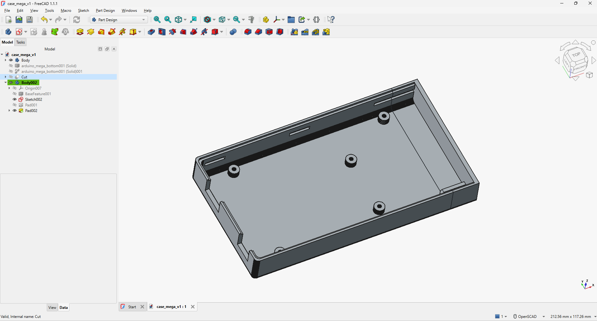

## Protipo de case para arduino mega

Se uso un ```stl``` de un arduino mega y luego se adaptó para tener la capacidad de adicionar la parte del cuveta para colocar el fluoroforo.



EL diseño se adaptó de este proyecto [LINK_PROYECTO](https://www.printables.com/model/523194-arduino-mega-2560-case/files)

El software usado fue:
- Freecad v1.1.1