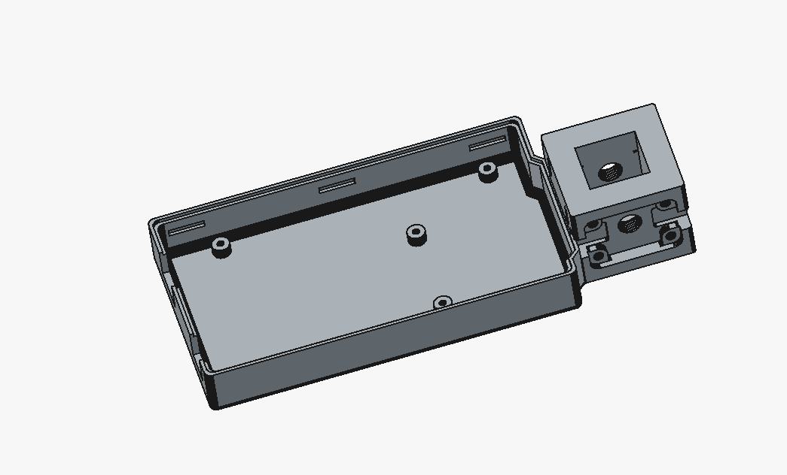

## Protipo de case para arduino mega 1
### Nombre: CASE_MEGA
Se uso un ```stl``` de un arduino mega y luego se adaptó para tener la capacidad de adicionar la parte del cuveta para colocar el fluoroforo.


EL diseño se adaptó de este proyecto [LINK_PROYECTO](https://www.printables.com/model/523194-arduino-mega-2560-case/files)

El software usado fue:
- Freecad v1.1.1

## Protipo de case para arduino mega 2
### Nombre: CASE_MEGA_CUBO
Se realizó otro diseño 3D del prototipo, en esta ocasión se juntaron el case del arduino mega y el cubo para realizar la excitación del fluoroforo.
